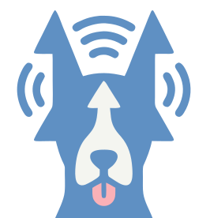

<div align="center">
  
  <h1>blep — BLE Pointer &amp; Tracker</h1>
  <p><em>Find your lost Bluetooth things — guided by signal strength.</em></p>
</div>

blep turns your phone (or watch) into a warm/cold pointer for nearby Bluetooth
Low Energy devices. Pick a device, and blep walks you to it: calibrate against
your chest, sweep to find the bearing, walk in, and pinpoint — with a single
animated arrow and a background colour that shifts from cool to warm as you
close in.

It's a minimalist, cross-platform Kotlin Multiplatform app (iOS, Android,
Apple Watch, Wear OS) plus a small static PWA landing page at
[blep.fyi](https://blep.fyi).

---

## How it works — the body-shielding technique

A phone's BLE radio is roughly omnidirectional, so raw RSSI tells you *how far*
but not *which way*. blep makes it directional using your own body:

> Hold the phone flat against your chest. Your torso absorbs ~10–20 dB of 2.4 GHz
> signal, so the reading is strongest when the target is **in front of you**.

From there it's a guided loop driven entirely by the change in signal (ΔRSSI):

1. **Calibrate** — hold at the chest; blep logs a baseline.
2. **Axis sweep** — turn slowly in place. blep says *warmer* / *turn back* and
   locks the bearing once the signal peaks and dips.
3. **Vector walk** — walk forward while it keeps improving; *stop* when you
   overshoot.
4. **Reorient** — re-sweep as needed.
5. **Pinpoint** — up close, kneel and search low.
6. **Done** — celebrate. 🎉

RSSI is noisy and multipath-prone, so this is an **assistive heuristic, not a
precise locator**. All thresholds live in
[`TrackingTuning`](app/core/src/commonMain/kotlin/fyi/blep/core/tracking/TrackingTuning.kt)
and are unit-tested.

## Repository layout

```
.
├── app/                      Kotlin Multiplatform project
│   ├── core/                 Pure tracking logic + BLE scanner (shared)
│   │   └── src/
│   │       ├── commonMain/   RssiFilter, SignalTrend, DeviceTable,
│   │       │                 TrackingSession, BleScanner (expect)
│   │       ├── commonTest/   JVM-runnable unit tests
│   │       ├── kableMain/    Kable scanner (Android + Apple share this)
│   │       └── jvmMain/      Fake scanner for tests/preview
│   ├── composeApp/           Compose Multiplatform phone UI (Android + iOS)
│   ├── wearApp/              Wear OS app (Wear Compose)
│   ├── iosApp/               SwiftUI shell for iPhone (XcodeGen)
│   └── watchApp/             SwiftUI watchOS app (uses shared BlepCore)
├── web/                      Vite + Tailwind PWA for blep.fyi
├── design/tokens.md          Design tokens shared by app + web
└── .github/workflows/        CI (tests + cross-platform compile) + Pages deploy
```

The `core` module is deliberately **free of platform and UI dependencies** so the
tracking logic is provable on a plain JVM. The Compose phone app and the Wear app
each provide their own thin state holder (`BlepController` / `WearController`)
over the same `TrackingSession`; the watchOS app does CoreBluetooth in Swift and
feeds RSSI into that same Kotlin engine.

## Architecture at a glance

```
        ┌─────────────────────── :core (commonMain, pure) ───────────────────────┐
        │  RssiFilter (EMA, ΔRSSI) → SignalTrend (peak/drop) → TrackingSession    │
        │  DeviceTable (dedup/sort/TTL)        BleScanner (expect)  TrackingStatus │
        └───────▲───────────────────────────────────▲─────────────────▲──────────┘
                │ actual (Kable)                     │ actual (Kable)   │ actual (fake)
            androidMain ─┐                       appleMain ─┐         jvmMain
                         └── kableMain (shared) ◄───────────┘
   ┌─────────────┴───────────┐     ┌────────────┴───────────┐   ┌──────┴───────┐
   │ composeApp (Android+iOS)│     │ wearApp (Wear Compose) │   │ watchApp     │
   │ BlepController + screens│     │ WearController         │   │ SwiftUI +    │
   └─────────────────────────┘     └────────────────────────┘   │ BlepCore     │
                                                                 └──────────────┘
```

## Building

The toolchain is pinned with [mise](https://mise.jdx.dev) (`mise.toml`): JDK 21
+ Gradle. Run `mise install` once, or use your own JDK 21.

### Core unit tests (no Android SDK needed)

```bash
cd app
./gradlew :core:jvmTest -Pblep.android=false
```

`-Pblep.android=false` skips the Android targets so the pure logic builds and
tests on any machine. CI runs the full matrix.

### Android (phone + Wear)

Requires the Android SDK (set `ANDROID_HOME` or `app/local.properties`).

```bash
cd app
./gradlew :composeApp:assembleDebug   # phone APK
./gradlew :wearApp:assembleDebug      # Wear OS APK
```

Min SDK 26 (phone) / 30 (Wear, Wear OS 3). BLE permissions are requested at
runtime (`BLUETOOTH_SCAN`/`BLUETOOTH_CONNECT` on 12+, `ACCESS_FINE_LOCATION`
below).

### iOS (iPhone)

Requires macOS + Xcode and [XcodeGen](https://github.com/yonaskolb/XcodeGen).

```bash
cd app/iosApp
xcodegen generate          # creates iosApp.xcodeproj
open iosApp.xcodeproj       # build/run in Xcode (a device is needed for BLE)
```

The project's pre-build phase runs
`./gradlew :composeApp:embedAndSignAppleFrameworkForXcode` to produce the shared
framework. `Info.plist` declares `NSBluetoothAlwaysUsageDescription`.

### watchOS (Apple Watch)

```bash
cd app/watchApp
xcodegen generate
open watchApp.xcodeproj
```

Links the `BlepCore` Kotlin/Native framework built from `:core`.

### Website

```bash
cd web
npm install
npm run dev        # local dev server
npm run build      # static output in web/dist
npm run gen:icons  # regenerate PWA PNG icons from logo.svg (only if it changes)
```

Deployed automatically to GitHub Pages by `.github/workflows/deploy.yml` on push
to `main`. Pages source (GitHub Actions) and the `blep.fyi` custom domain are
configured in the repository settings, so no `CNAME` file is committed.

## Platform support

| Platform        | Status | Notes                                             |
| --------------- | ------ | ------------------------------------------------- |
| Android phone   | ✅     | Compose Multiplatform                             |
| iOS (iPhone)    | ✅     | Compose Multiplatform in a SwiftUI shell          |
| Wear OS         | ✅     | Wear Compose, standalone                          |
| Apple Watch     | ✅     | SwiftUI + shared `BlepCore`                       |
| Zepp OS         | ❌     | Not feasible — Zepp OS mini-apps have no general third-party BLE central/scan API, which the tracking technique requires. |

## Donations

The website `#donate` section (the target of the app's *Help & donate* button)
supports **Stripe, Open Collective, PayPal and GitHub Sponsors**, each with a
downloadable receipt. The provider URLs in
[`web/index.html`](web/index.html) are placeholders marked `REPLACE_ME` — set
your real Stripe Payment Link, Open Collective slug, and PayPal hosted button id.

## Testing

`:core` ships JVM unit tests for the RSSI filter, trend detector, device table
and the full tracking state machine (calibration → … → completion, plus the
re-aim and stale-eviction edge cases). CI additionally compiles the Android,
iOS and watchOS targets to catch platform API regressions.

## License

See [`LICENSE`](LICENSE).
