<h3 align="center">
	
	<br/>
	blep
</h3>

<h6 align="center">
  <a href="https://blep.fyi">Website</a>
  ·
  <a href="#-how-it-works--the-body-shielding-technique">How it works</a>
  ·
  <a href="#-is-something-following-you">Anti-tracking</a>
  ·
  <a href="#-building">Build</a>
  ·
  <a href="https://blep.fyi/#donate">Donate</a>
</h6>

<p align="center">
	<a href="https://github.com/fentas/blep.fyi/stargazers">
		</a>
	<a href="https://github.com/fentas/blep.fyi/blob/main/LICENSE">
		</a>
	<a href="https://github.com/fentas/blep.fyi/actions/workflows/ci.yml">
		</a>
	<a href="https://blep.fyi">
		</a>
	<a href="https://kotlinlang.org/docs/multiplatform.html">
		</a>
</p>

<p align="center">
	
</p>

&nbsp;

<p align="center">
	
</p>

&nbsp;

<p align="left">

**blep** turns your phone — or your watch — into a warm/cold pointer for the
Bluetooth Low Energy devices already around you. Pick a device and blep walks
you to it: a single animated arrow and a background colour that shifts from cool
to warm as you close in. No extra hardware, no maps, no accounts.

The same scan runs the other way too: blep watches for **unwanted trackers**
travelling with you — an AirTag, Tile or SmartTag someone may have slipped into
your bag — and, because it's a finder, doesn't just warn but **points you to
it**. ([Anti-tracking ↓](#-is-something-following-you))

It's a minimalist, cross-platform [Kotlin Multiplatform](https://kotlinlang.org/docs/multiplatform.html)
app (iOS, Android, Apple Watch, Wear OS) plus a small static PWA landing page at
[blep.fyi](https://blep.fyi). Everything runs **on-device** — no accounts, no
analytics, no data collection.

</p>

&nbsp;

### 🐾 How it works — the body-shielding technique

A phone's BLE radio is roughly omnidirectional, so raw RSSI tells you *how far*
but not *which way*. blep makes it directional using your own body:

> Hold the phone flat against your chest. Your torso absorbs ~10–20 dB of 2.4 GHz
> signal, so the reading is strongest when the target is **in front of you**.

From there it's a guided loop driven entirely by the change in signal (ΔRSSI):

| Step | Phase | What you do | blep says |
| ---- | ----- | ----------- | --------- |
| 1 | **Calibrate** | Hold at your chest, stay still | *Hold at your chest* |
| 2 | **Axis sweep** | Turn slowly in place | *Warmer · turn back* |
| 3 | **Vector walk** | Walk forward | *Keep going · stop* |
| 4 | **Reorient** | Re-sweep as needed | *Turn again* |
| 5 | **Pinpoint** | Kneel, search low | *Almost there* |
| 6 | **Done** | 🎉 | *Finished — congratulations!* |

RSSI is noisy and multipath-prone, so this is an **assistive heuristic, not a
precise locator**. Every threshold lives in
[`TrackingTuning`](app/core/src/commonMain/kotlin/fyi/blep/core/tracking/TrackingTuning.kt)
and is unit-tested.

&nbsp;

### 🛰 Sensor fusion & the live map

The body-shielding loop is the floor, not the ceiling. When motion sensors are
present blep fuses them into a parallel **spatial tracker** — and degrades
cleanly back to RSSI-only when they aren't:

- **Compass + accelerometer + step counter + GPS** dead-reckon the path you walk
  (real step distance indoors; GPS-fused outdoors). Turning the phone no longer
  fools the tracker — signal swings during reorientation are discounted.
- A **recursive Bayesian particle filter** triangulates the target from the RSSI
  sampled along that path: each reading constrains it to a sphere, and the
  intersections across your route localise it. It accumulates evidence over time,
  **learns the environment's path-loss** as it goes, and can even **follow a
  moving target**.
- A **barometer** adds altitude, so the filter is **3-D** — it can tell you the
  target is *one floor up / down*.
- The screen is a **no-map radar**: your heading wedge (green toward / red away),
  a signal-coloured trail with a warm "fog", and the predicted target as a
  pulsing glow with an **uncertainty ellipse** — plus **turn-by-turn** copy
  ("turn 30° left · ~8 m") and a **Geiger-counter haptic + tone** that quickens
  as you close in. On phone, Wear OS, and Apple Watch.
- At **point-blank** the live signal trumps the estimate: rather than a stuck
  triangulated distance, it switches to a plain *"It's right here"* with a
  look-around hint. The whole UI is **light / dark / system** themable, with
  independent sound and vibration toggles.

It all lives in [`core/spatial`](app/core/src/commonMain/kotlin/fyi/blep/core/spatial)
— pure and unit-tested like the rest, with platform sensor providers behind an
`expect`/`actual` boundary.

&nbsp;

### 🛡 Is something following you?

A finder run in reverse is a tracker detector. Tap **"Is something tracking
you?"** and blep watches the same advertisements for a tag that's travelling
*with you*:

- **Known tracker kinds** — Find My (AirTag), Tile, Samsung SmartTag and other
  beacons are recognised by their manufacturer data / service UUIDs, including a
  Find My device advertising in **separated-from-owner** mode near you.
- **Address-rotation correlation** — a privacy tracker rotates its BLE address to
  stay anonymous, but gives itself away by **reappearing at the same close range
  again and again**. The un-correlation *is* the correlation — the trick AirTag
  detectors that key on a stable address miss.
- **Cross-session memory** (opt-in) — a small on-device log of close encounters
  by tracker *kind* + time. A tag that keeps showing up across separate hours —
  and, if you allow coarse location, across separate **places** — gets flagged as
  likely following you.
- **Background watch** (opt-in) — a foreground service / periodic worker keeps an
  eye out while the app is closed and notifies you, with a battery-minded
  interval (it skips actively ranging your *own* paired devices). On **Wear OS**
  the watch runs only the lighter **periodic (~30-min) check** — no continuous
  foreground service — to spare the watch battery; the phone does the continuous
  watch.
- **Sensitivity profiles** — Relaxed / Balanced / Strict retune the thresholds;
  surfaced both in Settings and on the safety screen.

Because blep is a finder, every alert is **actionable**: hit *Find* and it walks
you to the tag with the same warm/cold guidance. Everything stays **on-device**;
location is **opt-in, coarse, and never leaves the phone**. It lives in
[`core/safety`](app/core/src/commonMain/kotlin/fyi/blep/core/safety)
(`SafetyScanner` · `TrackerDetector` · `SafetyHistory`) — pure and unit-tested.

> [!WARNING]
> **Tracker detection is new and not yet widely field-tested.** It can produce
> **false negatives** (miss a real tracker) and **false positives** (flag a
> harmless device). Treat it as a helpful signal — not a guarantee — and don't
> rely on it alone for your safety. blep is a free side project, so real-world
> use *is* the testing: it gets better as people use it, and bug reports of a
> missed or mis-flagged tracker are very welcome.
Design notes: [`docs/detection.md`](docs/detection.md).

&nbsp;

### 🗂 Repository layout

```
.
├── app/                      Kotlin Multiplatform project
│   ├── core/                 Pure tracking logic + BLE scanner (shared, tested)
│   │   └── src/
│   │       ├── commonMain/   RssiFilter · SignalTrend · DeviceTable ·
│   │       │                 TrackingSession · BleScanner (expect) ·
│   │       │                 spatial/ (DeadReckoner · ParticleTargetEstimator ·
│   │       │                 StepCounter · PathLossCalibrator · MotionProvider) ·
│   │       │                 safety/ (SafetyScanner · TrackerDetector ·
│   │       │                 SafetyHistory · TrackerTuning)
│   │       ├── commonTest/   JVM-runnable unit tests
│   │       ├── kableMain/    Kable scanner (Android + Apple share this)
│   │       └── jvmMain/      Fake scanner for tests/preview
│   ├── composeApp/           Compose Multiplatform phone UI (Android + iOS):
│   │                         Discovery (favorites + paired) · Tracking ·
│   │                         Safety · Settings · background-scan service
│   ├── wearApp/              Wear OS app (Wear Compose)
│   ├── iosApp/               SwiftUI shell for iPhone (XcodeGen)
│   └── watchApp/             SwiftUI watchOS app (uses shared BlepCore)
├── web/                      Vite + Tailwind PWA for blep.fyi
├── design/tokens.md          Design tokens shared by app + web
└── .github/workflows/        CI (tests + cross-platform compile) + Pages deploy
```

The `core` module is deliberately **free of platform and UI dependencies** so the
tracking logic is provable on a plain JVM. The Compose phone app and the Wear app
each provide a thin state holder (`BlepController` / `WearController`) over the
same `TrackingSession`; the watchOS app does CoreBluetooth in Swift and feeds RSSI
into that same Kotlin engine — no Flow bridging.

&nbsp;

### 🏗 Architecture

```
        ┌─────────────────────── :core (commonMain, pure) ───────────────────────┐
        │  RssiFilter (EMA, ΔRSSI) → SignalTrend (peak/drop) → TrackingSession    │
        │  DeviceTable (dedup/sort/TTL)        BleScanner (expect)  TrackingStatus │
        └───────▲───────────────────────────────────▲─────────────────▲──────────┘
                │ actual (Kable)                     │ actual (Kable)   │ actual (fake)
            androidMain ─┐                       appleMain ─┐         jvmMain
                         └── kableMain (shared) ◄───────────┘
   ┌─────────────┴───────────┐     ┌────────────┴───────────┐   ┌──────┴───────┐
   │ composeApp (Android+iOS)│     │ wearApp (Wear Compose) │   │ watchApp     │
   │ BlepController + screens│     │ WearController         │   │ SwiftUI +    │
   └─────────────────────────┘     └────────────────────────┘   │ BlepCore     │
                                                                 └──────────────┘
```

&nbsp;

### 🔧 Building

The toolchain is pinned with [mise](https://mise.jdx.dev) (`mise.toml`):
JDK 21 + Gradle. Run `mise install` once, or bring your own JDK 21.

Common tasks are wrapped in a **`Makefile`** — run `make help`:

```
make test            # core unit tests (JVM)
make build           # phone + Wear debug APKs
make run             # install + launch blep on a connected phone
make emulator-setup  # one-time: install emulator + create the AVD
make emulator        # boot it (UI only — emulators have no Bluetooth)
make web             # website dev server
make ci              # what CI runs on Linux (tests + Android build)
```

**Core unit tests** — no Android SDK needed:

```bash
cd app
./gradlew :core:jvmTest -Pblep.android=false
```

`-Pblep.android=false` skips the Android targets so the pure logic builds and
tests anywhere. CI runs the full matrix.

**Android (phone + Wear)** — needs the Android SDK (`ANDROID_HOME` or
`app/local.properties`):

```bash
cd app
./gradlew :composeApp:assembleDebug   # phone APK
./gradlew :wearApp:assembleDebug      # Wear OS APK
```

Min SDK 26 (phone) / 30 (Wear OS 3). BLE permissions are requested at runtime.

**iOS / watchOS** — needs macOS + Xcode + [XcodeGen](https://github.com/yonaskolb/XcodeGen):

```bash
cd app/iosApp   && xcodegen generate && open iosApp.xcodeproj      # iPhone
cd app/watchApp && xcodegen generate && open watchApp.xcodeproj    # Apple Watch
```

A pre-build phase compiles the shared Kotlin framework via Gradle; the
`Info.plist`s declare `NSBluetoothAlwaysUsageDescription`.

**Website:**

```bash
cd web
npm install
npm run dev        # local dev server
npm run build      # static output in web/dist
npm run gen:icons  # regenerate PWA icons from logo.svg (only if it changes)
```

Deployed to GitHub Pages by `.github/workflows/deploy.yml` on push to `main`. The
Pages source and `blep.fyi` custom domain are set in repo settings, so no `CNAME`
file is committed.

&nbsp;

### 📱 Platform support

| Platform        | Status | Notes                                             |
| --------------- | :----: | ------------------------------------------------- |
| Android phone   | ✅ | Compose Multiplatform                                  |
| iOS (iPhone)    | ✅ | Compose Multiplatform in a SwiftUI shell               |
| Wear OS         | ✅ | Wear Compose, standalone                               |
| Apple Watch     | ✅ | SwiftUI + shared `BlepCore`                            |
| Zepp OS         | ❌ | Zepp OS mini-apps have no general third-party BLE central/scan API, which the tracking technique requires. |

&nbsp;

### ♥ Donations

The website `#donate` section (the target of the app's *Help & donate* button)
supports **Stripe, Open Collective, PayPal and GitHub Sponsors**, each with a
downloadable receipt. The provider URLs in [`web/index.html`](web/index.html) are
placeholders marked `REPLACE_ME` — set your Stripe Payment Link, Open Collective
slug, and PayPal hosted-button id.

&nbsp;

### 🧪 Testing & CI

`:core` ships JVM unit tests for the RSSI filter, trend detector, device table,
the full tracking state machine (calibration → … → completion, plus re-aim and
stale-eviction edge cases), and the whole **spatial layer** — dead reckoning,
particle-filter localisation (target found to within a few metres, follows a
moving target, 3-D floor detection), path-loss calibration, step counting, haptic
cadence and turn-by-turn guidance, all on synthetic walks — plus the **safety
layer** (tracker-kind recognition, address-rotation correlation, cross-session
history).
[CI](.github/workflows/ci.yml) additionally compiles the Android, iOS and watchOS
Kotlin targets **and builds the SwiftUI iOS + watchOS apps** (XcodeGen +
`xcodebuild`) so the Swift glue is verified too.

&nbsp;

### 📄 License

[MIT](LICENSE) © Jan Guth
